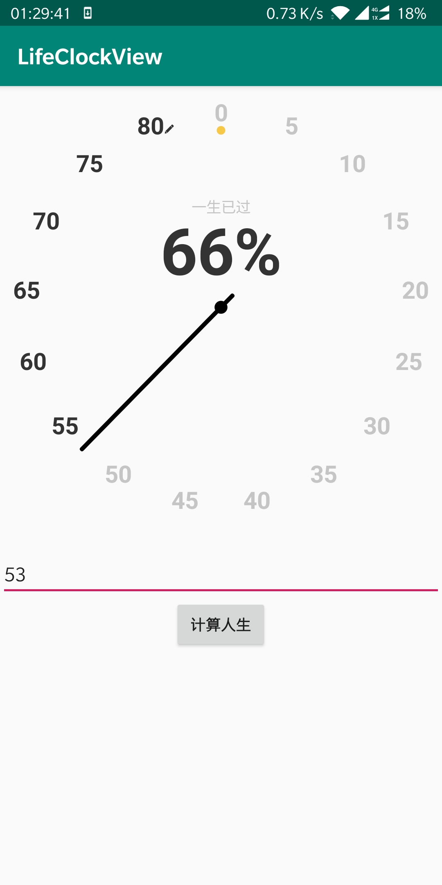

# 高仿【时光提醒】生命时钟View

使用Canvas绘制的生命时钟View，效果如下所示：

支持的自定义属性：

| 属性名                          | 类型      | 默认值  | 说明                                       |
| ------------------------------- | --------- | ------- | ------------------------------------------ |
| lcv_age_text_color              | color     | #333333 | 表盘未到达当前年龄年龄的字体颜色           |
| lcv_past_age_text_color         | color     | #C5C5C5 | 表盘已超过当前年龄的字体颜色               |
| lcv_age_text_size               | dimension | 22sp    | 表盘年龄字体大小                           |
| lcv_age_text_offset             | dimension | 24dp    | 表盘年龄字体中心与表盘半径的偏移量         |
| lcv_zero_age_down_circle_radius | dimension | 4dp     | 0岁下方圆点的半径                          |
| lcv_zero_age_down_circle_color  | color     | #F7C747 | 0岁下方圆点的颜色                          |
| lcv_zero_age_down_circle_offset | dimension | 5dp     | 0岁下方圆点的偏移量                        |
| lcv_center_circle_radius        | dimension | 6dp     | 中心圆点的半径                             |
| lcv_center_circle_color         | color     | #000000 | 中心圆点的颜色                             |
| lcv_pointer_line_width          | dimension | 4dp     | 指针的宽度                                 |
| lcv_pointer_line_color          | color     | #000000 | 指针的颜色                                 |
| lcv_current_max_age             | integer   | 80      | 表盘中显示的最大年龄，不可超过MAX_AGE(120) |

